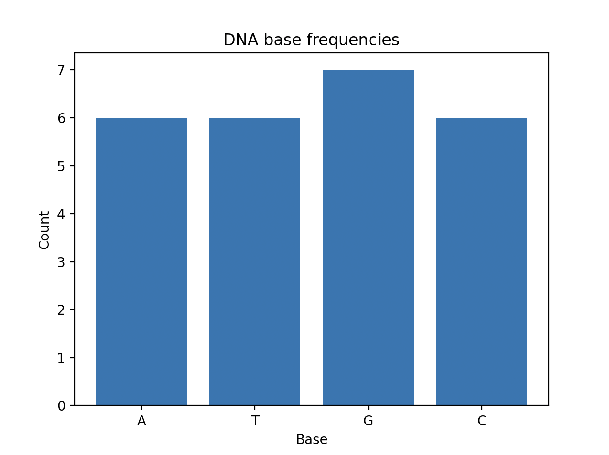
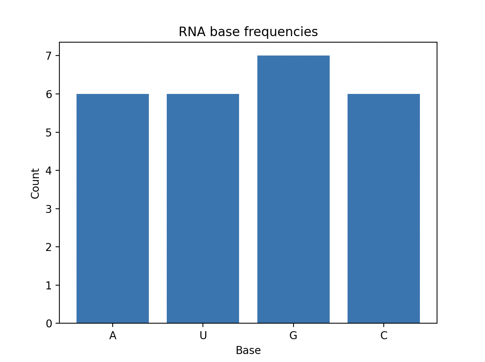
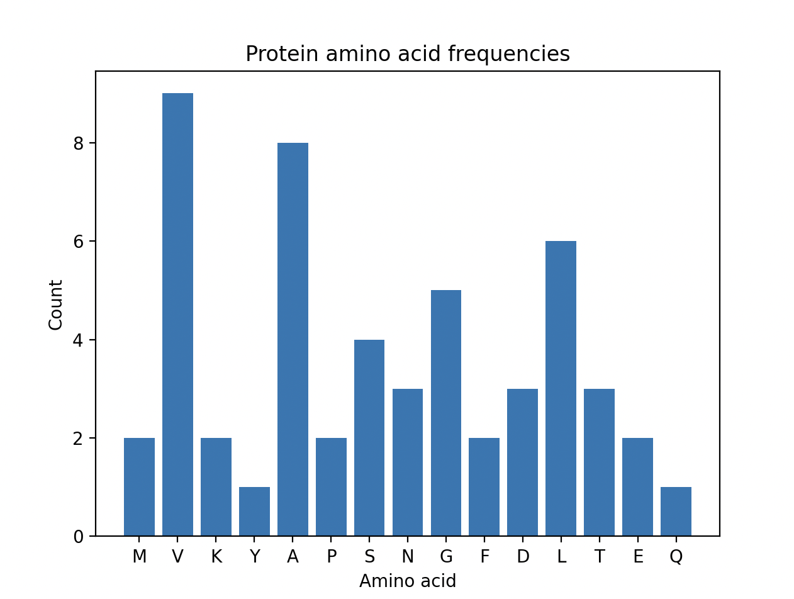

# Sequence analysis program
This is a lightweight bioinformatics program for basic analysis of biological sequences in FASTA format. It is suitable for handling DNA, RNA, and protein sequences. 
    Updated version of my first analysis program. 

## What it does 
- Reads a user-provided FASTA file, supporting multiple sequences
- Determines sequence type (DNA, RNA, or protein)
- Counts bases or amino acids
- Prints total number of bases/amino acids, individual counts and percentages
- Calculates GC-content for DNA/RNA sequences
- Creates a base/amino acid frequency plot
- Asks the user whether to save plots in a separate folder

## How to run the program
1. Make sure you have matplotlib installed: 
```bash
pip matplotlib install
```
2. Add your sequences to a text file in FASTA format. 
3. Run the script på calling a main() function.
4. When prompted, enter the filename of your sequence file (e.g. example_FASTA.txt).
5. When prompted, answer y or n to whether you would like to save your plots.

## Example output 
```bash
--- DNA_sequence_1 (DNA) ---
Total count: 25
A: 6 (24.0%)
T: 6 (24.0%)
G: 7 (28.0%)
C: 6 (24.0%)
G-C content: 52.0%
```



```bash
--- RNA_sequence_1 (RNA) ---
Total count: 25
A: 6 (24.0%)
U: 6 (24.0%)
G: 7 (28.0%)
C: 6 (24.0%)
G-C content: 52.0%
``` 


```bash
--- Protein_sequence_1 (protein) ---
Total count: 53
M: 2 (3.8%)
V: 9 (17.0%)
K: 2 (3.8%)
Y: 1 (1.9%)
A: 8 (15.1%)
P: 2 (3.8%)
S: 4 (7.5%)
N: 3 (5.7%)
G: 5 (9.4%)
F: 2 (3.8%)
D: 3 (5.7%)
L: 6 (11.3%)
T: 3 (5.7%)
E: 2 (3.8%)
Q: 1 (1.9%)
``` 



## What I've learned
- Modular programming and separating code into functions and files
- How to organize a project using an ideal folder structure
- Creating files with specific filenames based on input
- Saving plots to a newly created folder programmatically

